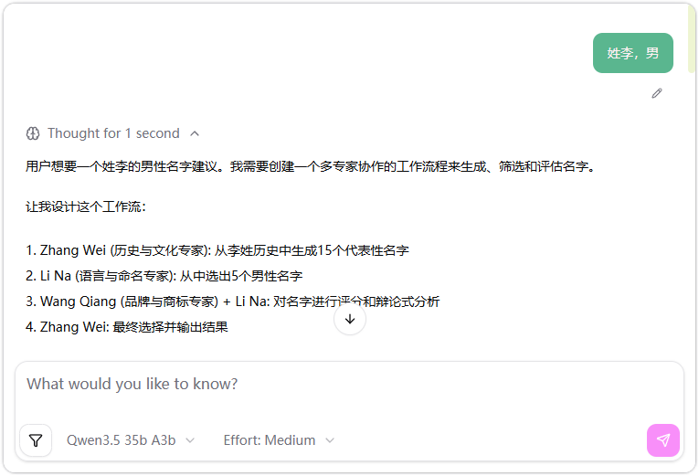
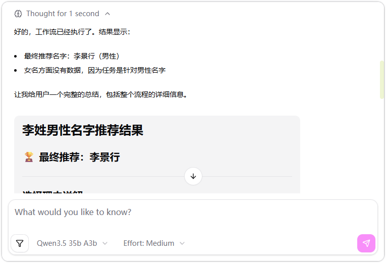

# agent-playbook

[中文](README_CN.md) | [English](README.md)

agent-playbook is YAML-configured multi-agent workflows powered by pydantic-ai DynamicWorkflow.

## Features

- YAML-configured agents on [pydantic-ai](https://ai.pydantic.dev/) + [pydantic-ai-harness](https://github.com/pydantic/pydantic-ai-harness) `DynamicWorkflow`
- Specialist `cast` members become sub-agents (`name`, `description`, `model` from config)
- Built-in naming, debate, requirement review, and code review agents
- Web chat UI via `agent.to_web()` (uvicorn)

## Installation

Python 3.10+. Uses [uv](https://docs.astral.sh/uv/) for dependencies:

```bash
git clone https://github.com/lhp0630/agent-playbook.git && cd agent-playbook
uv sync --all-groups
```

## Quick Start

Copy `.env.example` to `.env` and set your model credentials:

```bash
OPENAI_MODEL=your-model-name
OPENAI_BASE_URL=https://your-api-endpoint/v1
OPENAI_API_KEY=sk-xxx
```

Run a built-in playbook (`-n` must match the YAML `name` exactly; omit for a random pick). This starts a web chat UI — type your request in the browser:

```bash
agent -n "Name Generation"
agent -n "Office Debate"
agent -n "Requirement Review"
agent -n "Code Review"
```

Optional listen address via flags (defaults `127.0.0.1:8000`):

```bash
agent -n "Code Review" --host 127.0.0.1 --port 8000
```

Load custom playbook configs from a directory:

```bash
agent -n "My Playbook" -p ./my_playbooks
```

## Example

Name Generation in the web UI — the orchestrator plans a multi-cast workflow, then returns the result:

```bash
agent -n "Name Generation"
```

| | |
| --- | --- |
|  |  |

## License

[MIT](LICENSE)
