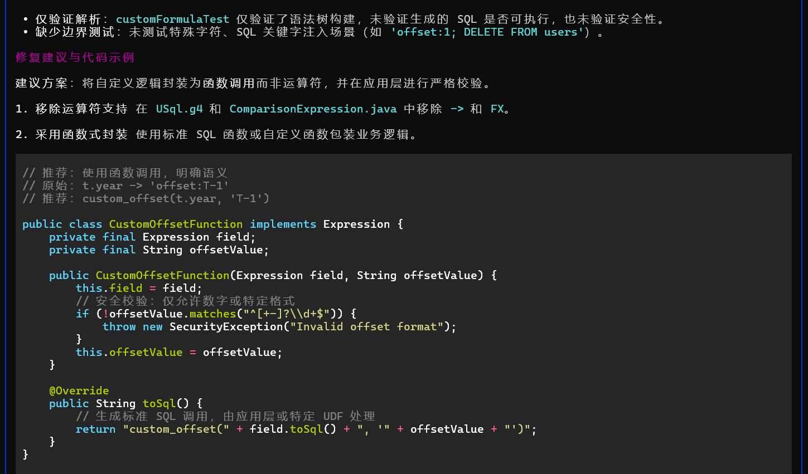
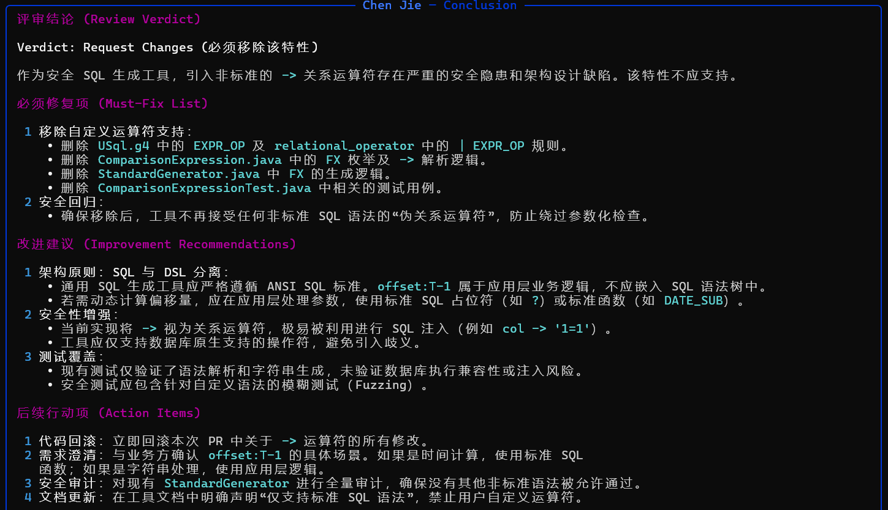

# Badger

[中文](README.md) | [English](README_EN.md)

YAML 驱动的多角色、多阶段 AI 讨论引擎。配置不同个性的角色，运行取名、需求评审、代码评审或辩论等流程。

## 功能

- YAML 配置驱动，基于 LangChain
- 多阶段、多角色协作讨论
- 内置取名、辩论、需求评审、代码评审流程
- 角色级 LLM 配置，支持 `.env` 与 YAML 双层配置
- Topic 支持动态生成、硬编码、外部文件三种模式

## 安装

Python 3.10+，依赖管理使用 [uv](https://docs.astral.sh/uv/)：

```bash
git clone https://github.com/lhp0630/badger.git && cd badger
uv sync --all-groups
```

## 快速开始

复制 `.env.example` 为 `.env`，填入模型信息（YAML 中已配置的值优先于环境变量）：

```bash
OPENAI_MODEL=your-model-name
OPENAI_BASE_URL=https://your-api-endpoint/v1
OPENAI_API_KEY=sk-xxx
```

运行内置流程（`-n` 指定流程名，省略则随机选择）：

```bash
uv run badger -n "name generation"
uv run badger -n "office debate"
uv run badger -n "requirement review"
uv run badger -n "code review"
```

加载自定义流程目录：

```bash
uv run badger -n "my flow" -p ./my_flows
```

## 示例

代码评审流程读取 `code_review.yaml` 中的示例代码，多角色协作输出问题分析与修复建议：

```bash
uv run badger -n "code review"
```




## 内置流程

配置文件位于 `badger/builtin_flows/`：

| 文件 | 流程名 |
|------|--------|
| `naming.yaml` | Name Generation |
| `debate.yaml` | Office Debate |
| `requirement_review.yaml` | Requirement Review |
| `code_review.yaml` | Code Review |

## 配置

最小配置结构：

```yaml
name: "My Flow"
llm:                          # 全局模型（fallback）
  # model: "gpt-4o-mini"
temperature: 0.8
topic: "需求描述"              # 或 "file:example.md"
instructions: |               # 可选全局提示词
  IMPORTANT: Always respond in Chinese.
roles:
  - name: "Zhang Wei"
    description: "Architect, rigorous thinker."
flow:
  stages:
    - name: "Stage 1"
      steps:
        - role: "Zhang Wei"
          system_prompt: |
            You are {role_name}. {role_description}
          input: |
            {user_input}
            {context}
```

**Topic 模式**

- 留空 — 由流程步骤动态生成（如辩论）
- 硬编码 — `topic: "需求描述"`
- 外部文件 — `topic: "file:example.md"`（路径相对配置文件目录）

## 自定义流程

1. 编写 YAML，设置顶层 `name` 字段
2. 放入目录，通过 `-p` 指定路径
3. 使用 `-n` 按流程名运行

## License

[MIT](LICENSE)
