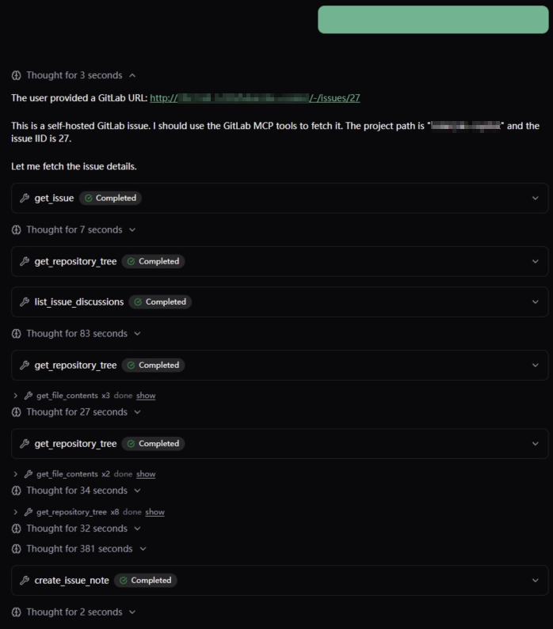

# agent-playbook

[中文](README_CN.md) | [English](README.md)

agent-playbook 是基于 pydantic-ai DynamicWorkflow 与 Agent Skills 的 YAML 多智能体工作流。

## 功能

- 在 [`.agents/`](.agents/) 用 YAML 编排多智能体 `DynamicWorkflow` 与 Agent Skills
- 内置 `code-review`

## 安装

Python 3.10+，依赖管理使用 [uv](https://docs.astral.sh/uv/)：

```bash
git clone --recurse-submodules https://github.com/lhp0630/agent-playbook.git && cd agent-playbook
uv sync --all-groups
```

若已克隆但未拉取子模块：

```bash
git submodule update --init --recursive
```

技能包位于 `.agents/skills/`（`first-principles-skill`、`5-whys-skill`、`code-review-skill`）。

## 快速开始

复制 `.env.example` 为 `.env`，填入凭证：

```bash
# 可选 — 启用 GitLab MCP，用于 GitLab 地址
GITLAB_API_URL=https://gitlab.example.com/api/v4
GITLAB_PERSONAL_ACCESS_TOKEN=glpat-xxx
```

运行 Playbook：

```bash
agent
```

访问 `http://127.0.0.1:8000`，粘贴 GitHub PR URL 或 GitLab MR URL。

## Playbook YAML

| 字段 | 必填 | 说明 |
| --- | :---: | --- |
| `name` | ✓ | 唯一 ID，如 `code-review` |
| `description` | | 一句话摘要，每次会话根据摘要匹配 Playbook |
| `instructions` | | orchestrator 运行规程 |
| `model_providers` | ✓ | LLM 提供方列表（`name`、`base_url`、`api_key`） |
| `model_providers[].name` | ✓ | 提供方 ID，如 `openai` |
| `model_providers[].base_url` | ✓ | API base URL |
| `model_providers[].api_key` | ✓ | API key |
| `models` | | 模型列表；省略时回退到 `OPENAI_*` 环境变量 |
| `models[].name` | ✓ | 模型 ID，如 `gpt-4o-mini` |
| `models[].model_provider` | ✓ | 对应 `model_providers` 中的 `name` |
| `model_settings` | | pydantic-ai `ModelSettings`（如 `temperature`） |
| `mcp_servers` | | MCP 工具列表 |
| `mcp_servers[].name` | ✓ | MCP 名称，如 `gitlab` |
| `mcp_servers[].commands` | ✓ | 命令数组，首项为可执行文件 |
| `mcp_servers[].env_vars` | | 环境变量名列表，或 `key: value` 字典 |
| `directories` | | Skill 库路径，默认 `.agents/skills` |
| `nodes` | ✓ | 工作流节点，按列表顺序执行 |
| `nodes[].name` | ✓ | 节点名，规范化后作为 `run_workflow` 函数名 |
| `nodes[].instructions` | | 节点提示词 |
| `nodes[].skills` | ✓ | Skill 名称数组，从 `directories` 中扫描 |
| `nodes[].models` | | 可选，节点级模型覆盖 |
| `nodes[].model_settings` | | 可选，节点级 settings 覆盖 |

## 示例

| GitHub | GitLab | 结果 | Issues |
| --- | --- | --- | --- |
|  |  |  |  |
