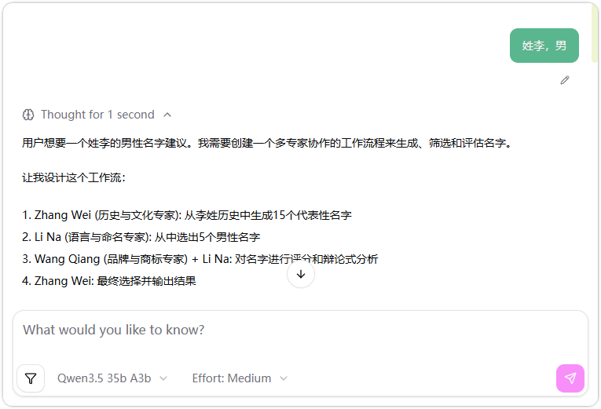
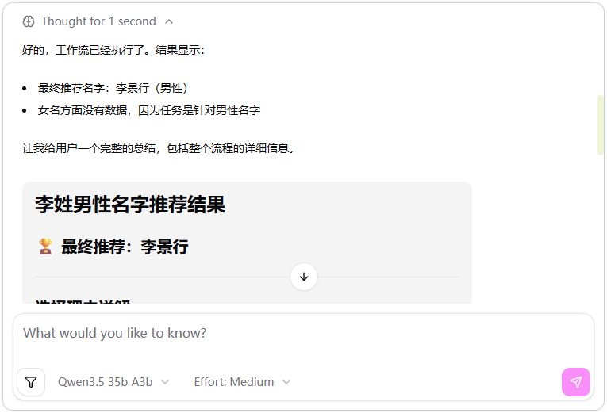
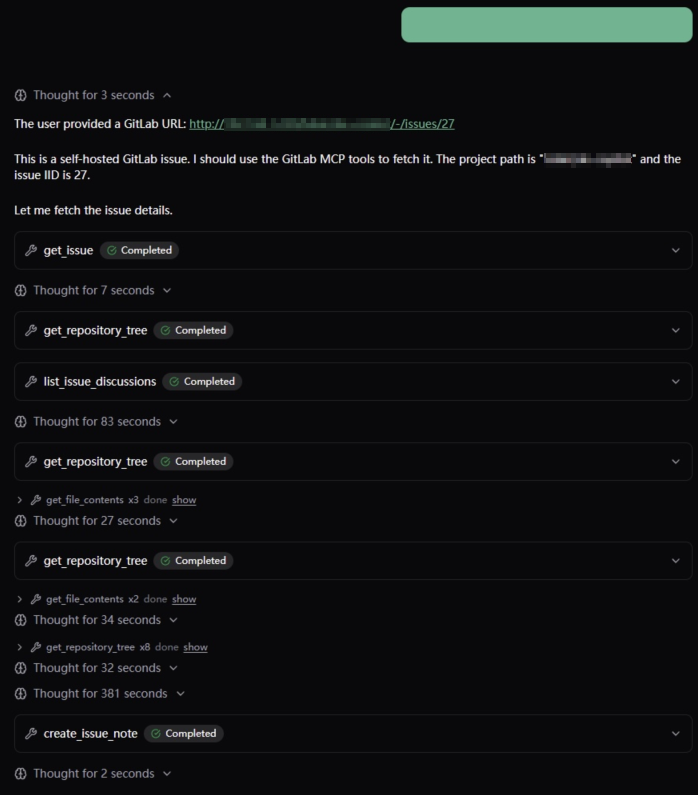

# agent-playbook

[中文](README_CN.md) | [English](README.md)

agent-playbook 将 YAML Playbook 封装为 pydantic-ai [`Capability`](https://ai.pydantic.dev/capabilities/)：命名 Skill 节点、DynamicWorkflow 编排，以及可选 MCP 工具。

## 功能

- **`Playbook` Capability**（[`agent.harness.playbook`](agent/harness/playbook/)）：通过 `Agent(..., capabilities=[Playbook(...)])` 挂载
- 在 [`.agents/`](.agents/) 用 YAML 描述节点 + Agent Skills + MCP，经 `Playbook.from_spec(**data)` 加载
- 内置 `code-review`（第一性原理 → 5 Whys → 代码审查），支持 GitHub WebFetch 与 GitLab MCP

## 安装

Python 3.10+，依赖管理使用 [uv](https://docs.astral.sh/uv/)（已包含 `pydantic-ai-harness[dynamic-workflow]`）：

```bash
git clone --recurse-submodules https://github.com/lhp0630/agent-playbook.git && cd agent-playbook
uv sync --all-groups
```

若已克隆但未拉取子模块：

```bash
git submodule update --init --recursive
```

技能包位于 `.agents/skills/`（`first-principles-skill`、`5-whys-skill`、`code-review-skill`）。

## 快速开始

复制 `.env.example` 为 `.env`，填入凭证：

```bash
# 省略 playbook `models` 时的模型回退
OPENAI_MODEL=...
OPENAI_BASE_URL=...
OPENAI_API_KEY=...

# 可选 — 启用 GitLab MCP，用于 GitLab 地址
GITLAB_API_URL=https://gitlab.example.com/api/v4
GITLAB_PERSONAL_ACCESS_TOKEN=glpat-xxx
```

运行 Playbook：

```bash
agent
# 或：agent --name=code-review
```

访问 `http://127.0.0.1:8000`，粘贴 GitHub PR URL，或 GitLab MR / Issue URL。

## 编程接入

从子模块导入（顶层 `agent` 不再导出 `Playbook`）：

```python
from pathlib import Path

from pydantic_ai import Agent
from yaml import safe_load

from agent.harness.playbook import Playbook

data = safe_load(Path('.agents/code-review.yaml').read_bytes())
playbook = Playbook.from_spec(**data)

agent = Agent(
    playbook.resolve_models()[0],
    name=playbook.name,
    description=playbook.description,
    capabilities=[playbook],
)
```

也可在代码中直接构造 Capability：

```python
from pydantic_ai import Agent
from agent.harness.playbook import Playbook

agent = Agent(
    'openai:gpt-4o-mini',
    capabilities=[
        Playbook(
            name='code-review',
            nodes=[],
            mcp_servers=[],
            models={'name': 'openai-chat:gpt-4o-mini', 'model_provider': 'openai'},
            model_providers=[
                {
                    'name': 'openai',
                    'base_url': 'https://api.openai.com/v1',
                    'api_key': '...',
                }
            ],
        )
    ],
)
```

更多说明见 [`agent/harness/playbook/README.md`](agent/harness/playbook/README.md)。

## Playbook YAML

| 字段 | 必填 | 说明 |
| --- | :---: | --- |
| `name` | ✓ | 唯一 ID，如 `code-review` |
| `description` | | 一句话摘要，每次会话根据摘要匹配 Playbook |
| `instructions` | | orchestrator 运行规程（经 Capability `get_instructions`） |
| `model_providers` | | LLM 提供方列表（`name`、`base_url`、`api_key`）；默认 `[]` |
| `model_providers[].name` | ✓ | 提供方 ID，如 `openai` |
| `model_providers[].base_url` | ✓ | API base URL |
| `model_providers[].api_key` | ✓ | API key |
| `models` | | 模型列表（单条或列表）；省略时回退到 `OPENAI_*` 环境变量 |
| `models[].name` | ✓ | 模型 ID，如 `openai-chat:gpt-4o-mini` |
| `models[].model_provider` | ✓ | 对应 `model_providers` 中的 `name` |
| `model_settings` | | pydantic-ai `ModelSettings`（如 `temperature`） |
| `mcp_servers` | | MCP 工具列表（stdio `commands`） |
| `mcp_servers[].name` | ✓ | MCP 名称，如 `gitlab` |
| `mcp_servers[].commands` | ✓ | 命令数组，首项为可执行文件 |
| `mcp_servers[].env_vars` | | 环境变量名列表，或 `key: value` 字典 |
| `directories` | | Skill 库路径，默认 `.agents/skills` |
| `nodes` | | 工作流节点 → DynamicWorkflow 子 Agent；默认 `[]` |
| `nodes[].name` | ✓ | 节点名，规范化后作为 `run_workflow` 函数名 |
| `nodes[].instructions` | | 节点提示词 |
| `nodes[].skills` | | Skill 名称数组，从 `directories` 中扫描；默认 `[]` |
| `nodes[].models` | | 可选，节点级模型覆盖 |
| `nodes[].model_settings` | | 可选，节点级 settings 覆盖 |

## 示例

| GitHub | GitLab | 结果 | Issues |
| --- | --- | --- | --- |
|  |  |  |  |
